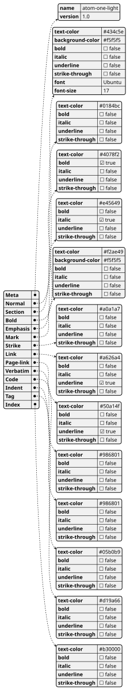

# atom-one-light.plantuml
Created 2026-06-09


## Description

## Journal
 - [X] Backlog
    - [ ] 
 - [X] Doing

 
## pl code


 
### Compilation code

*make.sh*
```bash
cat *.md > MAKE
noweb.py -Ratom-one-light.plantuml MAKE > atom-one-light.plantuml && plantuml atom-one-light.plantuml && echo 'atom-one-light.plantuml' && notify-send -a "Compilation of atom-one-light.plantuml" "" "$(date +"%Y-%m-%d") fertig" && gwenview atom-one-light.png 2>/dev/null 
```

### atom-one-light.plantuml

*atom-one-light.plantuml*
```pl
@startjson
#*atom-one-light.json}}
@endjson
```
